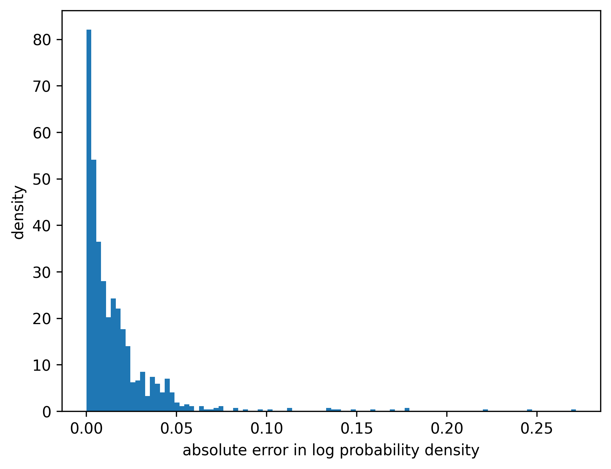
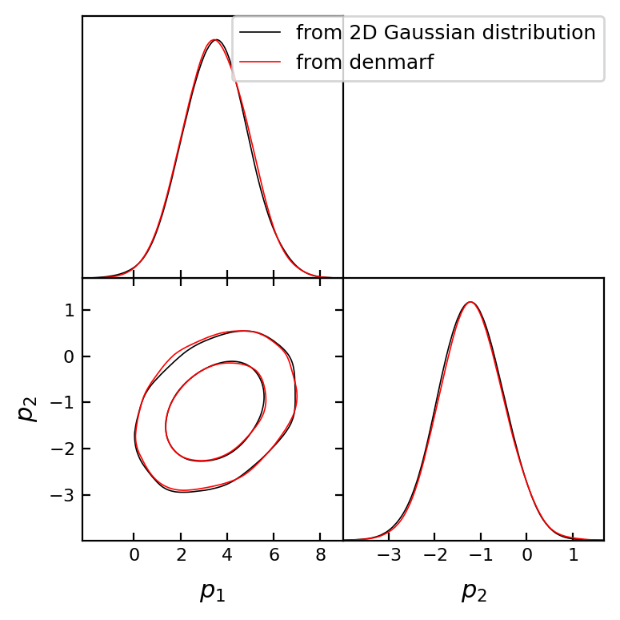

This is surely an overkill to use masked autoregressive flow (MAF) to
fit a 2D Gaussian distribution where we know how to evaluate its
probability density function exactly and generate samples efficiently
from the distribution. Therefore this notebook is really just an example
to show how to use ``denmarf``, and allows us to compare ``denmarf``
result with the exact result.

.. code:: ipython3

    # Run this cell once if denmarf is not installed already
    !pip install getdist denmarf

.. code:: ipython3

    # Import libraries
    
    import numpy as np
    from scipy.stats import multivariate_normal
    from denmarf import DensityEstimate
    
    # Plotting
    import matplotlib
    from matplotlib import pyplot as plt
    import getdist
    from getdist import MCSamples, plots
    %matplotlib inline
    %config InlineBackend.figure_format="retina"

Using ``denmarf`` to train a model
~~~~~~~~~~~~~~~~~~~~~~~~~~~~~~~~~~

**NOTE**: if you are running this notebook on Google colab, you can use
the GPU accleration by changing the runtime type. Go to Runtime ->
Change runtime type. Select GPU and then restart the session.

.. code:: ipython3

    # Initialize a 2D Gaussian with certain mean and covariance matrix
    gaussian_dist = multivariate_normal([3.5, -1.2], [[2.0, 0.3], [0.3, 0.5]])
    
    # Generate some samples from the 2D Gaussian distribution
    xgen = gaussian_dist.rvs(size=int(1e5))
    
    de = DensityEstimate().fit(
        xgen,
        num_blocks=2,
        num_hidden=5,
        num_epochs=100,
    )

.. parsed-literal::

    current average log likelihood: -2.784: 100%|██████████| 100/100 [01:22<00:00,  1.22it/s]

.. parsed-literal::

    best average log likelihood: -2.780

.. parsed-literal::

    

Evaluating the estimated density
~~~~~~~~~~~~~~~~~~~~~~~~~~~~~~~~

.. code:: ipython3

    # Evaluate the log pdf on these points
    xeval = gaussian_dist.rvs(size=1000)
    
    # Compute the logpdf using the density estimate
    logpdf_maf = de.score_samples(xeval)
    
    # Compute the logpdf using the exact form
    logpdf_truth = gaussian_dist.logpdf(xeval)

.. code:: ipython3

    # Make a histogram quantifying the distribution of error
    plt.figure(dpi=150)
    plt.hist(np.abs(logpdf_truth - logpdf_maf), bins=100, density=True)
    plt.xlabel("absolute error in log probability density")
    plt.ylabel("density")

.. parsed-literal::

    Text(0, 0.5, 'density')

Generating new samples
~~~~~~~~~~~~~~~~~~~~~~

.. code:: ipython3

    # Generate new samples from the exact distribution
    xgen_exact = gaussian_dist.rvs(size=10000)
    # Generate new samples from the DensityEstimate object
    xgen_maf = de.sample(10000)

.. code:: ipython3

    samples_exact = MCSamples(samples=xgen_exact, label="from 2D Gaussian distribution")
    samples_maf = MCSamples(samples=xgen_maf, label="from denmarf")
    
    g1 = plots.get_subplot_plotter()
    g1.triangle_plot([samples_exact, samples_maf], filled=False)

.. parsed-literal::

    Removed no burn in
    Removed no burn in

